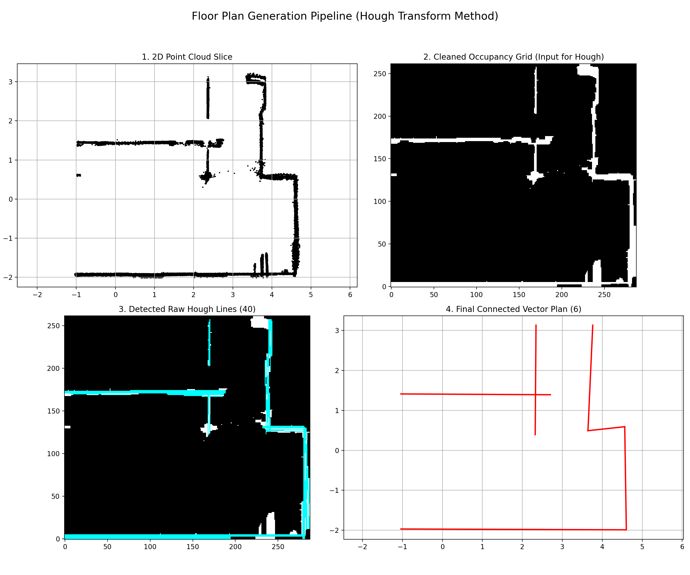

# Semantic Segmentation of 3D Point Clouds and Floor Plan Prediction

## Table of Contents

1.  [Overview](#1-overview)
2.  [The Pipeline](#2-the-pipeline)
    *   [Stage 1: 3D Semantic Segmentation](#21-stage-1-3d-semantic-segmentation)
    *   [Stage 2: Structural Extraction and Geometric Refinement](#22-stage-2-structural-extraction-and-geometric-refinement)
    *   [Stage 3: 2D Floor Plan Generation](#23-stage-3-2d-floor-plan-generation)
3.  [Usage Guide](#3-usage-guide)
    *   [Environment Setup](#31-environment-setup)
    *   [Script: Planar Cloud Extraction (Segmentation Only)](#32-script-planar-cloud-extraction-segmentation-only)
    *   [Script: Floor Plan Extraction (Full Pipeline)](#33-script-floor-plan-extraction-full-pipeline)
    *   [Script: Planar Mesh Reconstruction](#34-script-planar-mesh-reconstruction)

---

## 1. Overview

This document details an automated pipeline designed to convert raw 3D point cloud data of indoor environments into structured, two-dimensional floor plans. The core challenge lies in translating an unstructured set of millions of points into a semantically meaningful and geometrically accurate architectural drawing.

Our approach leverages a multi-stage process that combines deep learning with classical geometric algorithms:

1.  **Semantic Understanding:** The pipeline first employs a powerful 3D semantic segmentation model (**RandLANet**) to assign a categorical label (e.g., `wall`, `floor`, `door`, `clutter`) to every point in the cloud.
2.  **Geometric Refinement:** Recognizing that deep learning models can produce noisy or incomplete segmentations, a crucial post-processing step uses **RANSAC** (RANdom SAmple Consensus) to fit geometric primitives (planes and cylinders) to the structural elements. This allows the system to correct misclassifications and intelligently reclaim points from the `clutter` category.
3.  **Vectorized Output:** Finally, the refined 3D structural point cloud is projected onto a 2D plane. Image processing techniques, including the **Hough Transform**, are used to detect lines and create a clean, vectorized floor plan.

This hybrid methodology ensures that the final output is not only semantically informed but also geometrically robust, resulting in high-quality architectural plans from raw scan data.


---

## 2. The Pipeline

The pipeline transforms a raw 3D point cloud into a 2D floor plan through three distinct stages: Semantic Segmentation, Geometric Refinement, and 2D Plan Generation. Each stage builds upon the output of the previous one to progressively add structure and accuracy.

### 2.1. Stage 1: 3D Semantic Segmentation

This initial stage is responsible for assigning a meaningful category to every point in the 3D space, forming the foundation for all subsequent processing.

#### 2.1.1. Model and Pipeline Preparation

The pipeline's core is powered by the **Open3D-ML** library, which provides a framework for 3D machine learning tasks.

*   **Model Selection:** We utilize the **RandLANet** model, pre-trained on the comprehensive **S3DIS (Stanford 3D Indoor Scene Dataset)**. This model is chosen for its state-of-the-art performance and high mean Intersection-over-Union (mIoU) score on indoor segmentation tasks.
*   **Configuration:** The pipeline is initialized by loading the `randlanet_s3dis.yml` configuration file, which contains all necessary parameters for the model's architecture, data handling, and training/testing procedures.
*   **Weight Loading:** The system is designed for ease of use. It first checks for a local copy of the pre-trained model weights (checkpoint file). If a checkpoint is not found, it automatically establishes an HTTP request to download the necessary files.

#### 2.1.2. Data Preparation

For the RandLANet model to process custom data correctly, the input point cloud must be structured in a specific dictionary format. An improperly formatted input will result in a runtime error.

The required dictionary must contain the following keys:
*   `point`: An array of shape `(N, 3)` containing the (X, Y, Z) coordinates for all *N* points in the cloud.
*   `feat`: An array of shape `(N, 3)` containing the (R, G, B) color values for each point. These values are typically normalized to the range [0, 1].
*   `label`: An array of shape `(N,)` used as a placeholder during inference. It is typically initialized with zeros.

#### 2.1.3. Inference and Mathematical Formulation

With the pipeline and data prepared, the inference process can begin. The input data dictionary is fed into the pre-trained model, which classifies each point.

**Mathematical Formulation**

Let the input point cloud be a set of $N$ points in 3D space:
```math
P = \{p_i \in \mathbb{R}^3 \mid i = 1, \dots, N\}
```

The model uses a set of predefined semantic labels $L$ from the S3DIS dataset:
```python
s3dis_labels = {
    0: 'unlabeled', 1: 'ceiling', 2: 'floor',  3: 'wall',    4: 'beam',
    5: 'column',    6: 'window',  7: 'door',    8: 'table',   9: 'chair',
    10: 'sofa',     11: 'bookcase',12: 'board',   13: 'clutter'
}
```
The segmentation model, represented as a function $f_{\text{model}}$, takes the point cloud $P$ as input and outputs a predicted label vector $\hat{Y}$, where each element $\hat{y}_i$ corresponds to a point $p_i$:

```math
\hat{Y} = f_{\text{model}}(P) = \{\hat{y}_1, \hat{y}_2, \dots, \hat{y}_N\}, \quad \text{where } \hat{y}_i \in L
```

The point cloud is then partitioned into distinct subsets $P_l$ based on these inferred labels, allowing us to isolate specific architectural elements:

```math
P_l = \{ p_i \in P \mid \hat{y}_i = l \}, \quad \text{where } l \in L
```
Sample Output:  
Input .Ply indoor scan file ([Download Here]( https://drive.google.com/file/d/12G2ybHiIUwcarr9TjmRYsoLz61BEN-Zn/view)):  
  
Inference from RandLANet:  
 

---
### 2.2. Stage 2: Structural Extraction and Geometric Refinement

The raw output from the semantic segmentation model, while powerful, is not perfect. Structural elements are often incomplete, with many of their points misclassified into the `clutter` category. This stage addresses this issue by using geometric priors—the assumption that elements like walls are planar and columns are cylindrical—to intelligently refine the initial segmentation.

#### 2.2.1. Initial Class Segregation

First, we partition the segmented point cloud $P$ into three distinct groups based on their labels.

Let the sets of labels for structural components, furniture, and other excluded classes be defined as:
*   **Structural Classes ($S_{\text{struct}}$):** Labels for components essential to the floor plan.
    ```math
    S_{\text{struct}} = \{\text{floor, wall, beam, column, window, door}\} 
    ```
*   **Furniture Classes ($F_{\text{furn}}$):** Labels for furniture items, which are ignored.
    ```math 
    F_{\text{furn}} = \{\text{table, chair, sofa, bookcase, board}\} 
    ```
*   **Excluded Classes ($E_{\text{exclude}}$):** All labels to be completely removed before refinement. This includes furniture, the ceiling, and any unlabeled points.
    ```math 
    E_{\text{exclude}} = \{\text{unlabeled, ceiling}\} \cup F_{\text{furn}} 
    ```

Using these label sets, we define our initial point cloud groups:
1.  **Initial Structural Point Clouds ( $P_l$ for $l \in S_{\text{struct}}$ ):** The baseline sets of points for each structural class, taken directly from the segmentation output.
2.  **The Clutter Pool ($P_C$):** This is the set of points labeled as `clutter`. These points are candidates to be reassigned to a structural class.
    ```math 
    P_C = \{ p_i \in P \mid \hat{y}_i = \text{clutter} \} 
    ```
3.  **Excluded Points:** All points belonging to classes in $E_{\text{exclude}}$ are discarded.

#### 2.2.2. Iterative RANSAC Refinement

The core of the refinement process is an iterative loop over each structural class. For each class, we identify its dominant geometric shape(s) using RANSAC (RANdom SAmple Consensus) and use these shapes to "claim" matching points from the clutter pool ($P_C$).

**A. Planar Class Refinement (`wall`, `floor`, `window`, `door`)**

For classes that are predominantly planar, the process is as follows:

1.  **Model Discovery (`discover_planes`):** For a given class (e.g., `wall`), we run RANSAC on its initial point cloud, $P_{\text{wall}}$, to find a set of plane models $\mathcal{M}_{\text{planes}}$. Each plane model $m \in \mathcal{M}_{\text{planes}}$ is defined by the Hessian normal form:
    ```math 
    m = (a, b, c, d) \quad \text{such that} \quad ax + by + cz + d = 0, \quad \text{with} \quad a^2+b^2+c^2=1 
    ```
2.  **Refinement (`refine_with_planes`):** We then test every point $p_c = (x_c, y_c, z_c)$ in the clutter pool $P_C$ against each discovered plane model $m$. A point $p_c$ is considered an **inlier** to model $m$ if its perpendicular distance to the plane is less than a threshold $\epsilon_{\text{plane}}$:
    ```math 
    |ax_c + by_c + cz_c + d| < \epsilon_{\text{plane}} 
    ```
3.  **Update:** All inlier points found in $P_C$ are removed from the clutter pool and added to the corresponding structural point cloud. Let $I_l$ be the set of all inliers from $P_C$ for a class $l$. The sets are updated as:
    ```math 
    P'_l = P_l \cup I_l 
    ```
    ```math 
    P'_C = P_C \setminus I_l 
    ```

**B. Cylindrical Class Refinement (`column`, `beam`) (Optional)**

For classes expected to be cylindrical, a more specialized RANSAC is used:

1.  **Model Discovery (`discover_cylinders_manual`):**
    *   **Projection:** First, the 3D points of the class (e.g., $P_{\text{column}}$) are projected onto a 2D plane (the XZ-plane for vertical columns) by discarding the Y-coordinate: $p=(x,y,z) \to p'=(x,z)$.
    *   **2D RANSAC:** A manual RANSAC is performed on these 2D points to find circle models. A circle is defined by its center $c'=(c_x, c_z)$ and radius $r$. A point $p'$ is an inlier to a circle model if its distance from the perimeter is less than a threshold $\epsilon_{\text{circle}}$:
        ```math  
        \left| \sqrt{(p'_x - c_x)^2 + (p'_z - c_z)^2} - r \right| < \epsilon_{\text{circle}} 
        ```
    *   **Model Lifting:** The discovered 2D circle models are lifted into 3D vertical cylinder models, represented by a point on the axis, the axis direction vector, and the radius. Let this set be $\mathcal{M}_{\text{cylinders}}$.

2.  **Refinement (`refine_with_cylinders`):** Each point $p_c$ in the clutter pool $P_C$ is tested against each cylinder model. A point $p_c$ is an inlier to a cylinder model $(C_0, \vec{a}, r)$ (where $C_0$ is a point on the axis and $\vec{a}$ is the axis direction) if its distance to the cylinder's surface is less than a threshold $\epsilon_{\text{cylinder}}$. The distance of $p_c$ to the cylinder's axis is calculated first:
    ```math 
    d(p_c, \text{axis}) = \frac{\| (p_c - C_0) \times \vec{a} \|}{\| \vec{a} \|} 
    ```
    The point is an inlier if:
    ```math
    | d(p_c, \text{axis}) - r | < \epsilon_{\text{cylinder}}
    ```
3.  **Update:** As with planar refinement, all cylindrical inliers are moved from the clutter pool $P_C$ to the appropriate structural class point cloud.

This iterative refinement process significantly improves the completeness of the structural elements, creating a much cleaner point cloud that is ready for the final floor plan generation stage.

Initial Result:
| <span style="color:red;">**Before (Raw 3D Segmentation Output)**</span> | <span style="color:blue;">**After (Iterative RANSAC Refinement)**</span> |
|:-------------------------------------------------------------------------:|:--------------------------------------------------------------------------:|
|               |                |
|               |                |
|               |                |
---
### 2.3. Stage 3: 2D Floor Plan Generation

With a clean, refined set of 3D structural points, the final stage is to convert this data into a 2D vectorized floor plan. This process, encapsulated in the `pcd_to_plan` function, involves projecting the points, rasterizing them into an image, and then extracting geometric lines from that image.

#### 2.3.1. 2D Projection and Occupancy Grid Creation

The first step is to transform the 3D data into a 2D representation suitable for image processing.

1.  **Horizontal Slicing:** To simulate a standard architectural blueprint view, we take a horizontal cross-section of the 3D point cloud. A slice is defined by a `SLICE_HEIGHT` and a `SLICE_THICKNESS`. All points $p_i = (x_i, y_i, z_i)$ from the refined structural cloud $P'_{\text{struct}}$ that fall within this vertical range are selected.

    Let $h$ be `SLICE_HEIGHT` and $t$ be `SLICE_THICKNESS`. A point $p_i$ is included in the slice $P_{\text{slice}}$ if:
    ```math
    (h - t/2) \le z_i \le (h + t/2)
    ```

2.  **Projection:** The 3D points in $P_{\text{slice}}$ are then projected onto the XY-plane by simply discarding their Z-coordinate, creating a 2D point set, $P_{2D}$.
    ```math 
    (x_i, y_i, z_i) \to (x'_i, y'_i) = (x_i, y_i)
    ``` 

3.  **Rasterization (`create_occupancy_grid`):** The 2D points are converted into a binary image called an occupancy grid.
    *   **Grid Definition:** The process first determines the spatial extent of the 2D points (a bounding box) and creates a grid of pixels, where each pixel represents a physical area defined by `GRID_RESOLUTION`.
    *   **Point-to-Pixel Mapping:** Each 2D point $(x'_i, y'_i)$ is mapped to a discrete pixel coordinate $(u_i, v_i)$ in the grid. This transformation involves a translation and scaling:
        ```math 
        u_i = \left\lfloor \frac{x'_i - x_{\min}}{\text{resolution}} \right\rfloor, \quad v_i = \left\lfloor \frac{y'_i - y_{\min}}{\text{resolution}} \right\rfloor
        ```
    *   **Occupancy:** The pixel at each coordinate $(u_i, v_i)$ is marked as occupied (set to a value of 255).
    *   **Cleaning:** A **morphological closing** operation (`cv2.morphologyEx` with `cv2.MORPH_CLOSE`) is applied to the grid. This computer vision technique first dilates the image (thickening features) and then erodes it (thinning them back). The net effect is the closure of small gaps and holes in the detected walls, creating more continuous features for the next step.

#### 2.3.2. Vectorization via Hough Transform and Refinement

The occupancy grid is a raster image. To create a true floor plan, we must convert it back into a vector format—a set of lines.

1.  **Line Segment Detection (`cv2.HoughLinesP`):** The **Probabilistic Hough Transform** is applied to the cleaned occupancy grid. Unlike the standard Hough Transform, this algorithm directly detects and returns the endpoints of line segments, which is more efficient for this task. It is governed by key parameters:
    *   `HOUGH_THRESHOLD`: The minimum number of collinear points required to form a line.
    *   `HOUGH_MIN_LINE_LENGTH`: The minimum length of a line in pixels to be considered valid.
    *   `HOUGH_MAX_LINE_GAP`: The maximum allowed gap between two points on the same line.

2.  **Line Merging (`merge_lines`):** The raw output from the Hough Transform is often fragmented into many small, collinear segments. This step merges them into longer, more coherent lines. Two lines are considered candidates for merging if:
    *   **Angle Similarity:** The difference in their angles is below `MERGE_ANGLE_TOLERANCE`.
    *   **Proximity:** The perpendicular distance from an endpoint of one line to the infinite line defined by the other is below `MERGE_DISTANCE_TOLERANCE`. The distance from a point $p_1$ to a line passing through points $p_a$ and $p_b$ is given by:
        ```math 
        d(p_1, \text{line}(p_a, p_b)) = \frac{\| (p_1 - p_a) \times (p_b - p_a) \|}{\| p_b - p_a \|}
        ``` 
    Once a cluster of mergeable lines is identified, `cv2.fitLine` is used to compute a single best-fit line through all their constituent points, creating a new, unified line segment.

3.  **Corner Snapping (`connect_corners`):** To create architecturally clean corners and intersections, this final step adjusts the endpoints of the merged lines.
    *   The algorithm identifies clusters of line endpoints that are closer to each other than the `SNAP_TOLERANCE`. The distance between two endpoints $e_i = (x_i, y_i)$ and $e_j = (x_j, y_j)$ is the standard Euclidean distance:
        ```math 
        d(e_i, e_j) = \sqrt{(x_i - x_j)^2 + (y_i - y_j)^2} < \text{SNAP\_TOLERANCE}
        ``` 
    *   For each identified cluster, a new corner point is calculated by finding the centroid (average position) of all endpoints in that cluster.
    *   The endpoints of the original lines are then updated to "snap" to this new, single corner point, ensuring that walls connect perfectly.

Final Result: 


---
## 3. Usage Guide

This section provides all the necessary steps to set up the environment and run the various scripts included in the project.

### 3.1. Environment Setup

It is highly recommended to use a dedicated Conda environment to manage the project's dependencies. This ensures that the correct package versions are used and avoids conflicts with other projects.

1.  **Create and Activate the Conda Environment:**
    Open your terminal and run the following commands to create a new environment named `floorplan` with Python 3.8.18 and activate it.

    ```bash
    conda create -n floorplan python=3.8.18 -y
    conda activate floorplan
    ```

2.  **Install Required Packages:**
    Navigate to the `scripts` directory within the project folder. All required packages are listed in the `requirements.txt` file. Install them using pip.

    ```bash
    cd path/to/your/project/scripts
    pip install -r requirements.txt
    ```

With the environment set up, you can now run the processing scripts.

### 3.2. Script: Planar Cloud Extraction (Segmentation Only)

This script runs only the initial semantic segmentation stage. It processes an input point cloud and saves the raw point clouds for major structural categories (floor, walls, etc.) and all other categories into separate files. No RANSAC refinement is performed.

*   **Script:** `segmentation_pcd_extraction.py`
*   **Arguments:**
    *   `--data_path`: **(Required)** Path to the input point cloud file (`.ply`).
    *   `--output_dir`: **(Required)** Directory where the output `.ply` files (e.g., `walls.ply`, `floor.ply`, `others.ply`) will be stored.
*   **Example:**
    ```bash
    python segmentation_pcd_extraction.py --data_path ../data/conferenceRoom_1.ply --output_dir ../output/segmented_parts/
    ```

### 3.3. Script: Floor Plan Extraction (Full Pipeline)

This is the main script that executes the entire pipeline: from semantic segmentation and RANSAC refinement to the final 2D floor plan generation.

*   **Script:** `pcd_to_floorplan.py`
*   **Arguments:**
    *   `--data_path`: **(Required)** Path to the input point cloud file (`.ply`).
    *   `--output_dir`: **(Required)** Directory where the final floor plan image (`.png`) will be saved.
    *   `--refine_cylinders`: **(Optional Flag)** Enables the RANSAC cylinder fitting routine for columns and beams. This can improve results in rooms with columns but will increase processing time.
    *   `--vis_prediction`: **(Optional Flag)** Opens the Open3D-ML visualizer to show the raw semantic segmentation results on the point cloud.
    *   `--vis_open3d`: **(Optional Flag)** Opens a visualizer to compare the structural point cloud before and after RANSAC refinement.
*   **Example:**
    ```bash
    python floor_plan_main.py \
      --data_path ../data/conferenceRoom_1.ply \
      --output_dir ../output/ \
      --refine_cylinders \
      --vis_open3d
    ```

### 3.4. Script: Planar Mesh Reconstruction

This utility script takes individual point clouds of structural elements (like those generated by `segmentation_pcd_extraction.py`) and attempts to reconstruct a 3D mesh from them.

*   **Script:** `reconstruct.py`
*   **Arguments:**
    *   `-iw, --walls_file`: Input point cloud of just the walls.
    *   `-if, --floor_file`: Input point cloud of the floor.
    *   `-ic, --ceiling_file`: Input point cloud of the ceiling.
    *   `-io, --others_file`: Input point cloud of all other points.
    *   `-o, --output`: Path for the output mesh file (e.g., `out.ply`).
    *   `-m, --meshing_algorithm`: Algorithm to use. Options are `poisson` (default), `ball_pivot`, or `alpha_shapes`.
    *   `--no_projection`: **(Optional Flag)** Do not project all points to a plane.
    *   `--no_segmentation`: **(Optional Flag)** Do not process wall segments individually.
*   **Example:**
    ```bash
    python reconstruct.py \
      -iw ../output/segmented_parts/walls.ply \
      -if ../output/segmented_parts/floor.ply \
      -ic ../output/segmented_parts/ceiling.ply \
      -io ../output/segmented_parts/others.ply \
      -o ../output/reconstructed_mesh.ply \
      -m poisson
    ```